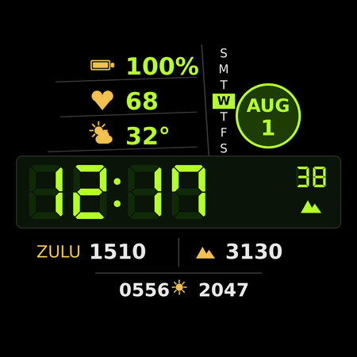

# Tactical — a Wear OS watch face



A dense, instrument-panel watch face in **Watch Face Format** (WFF), built for the
**Pixel Watch 4 45mm** (456×456, Wear OS 6). Seven-segment time with the unlit
segments showing behind it, a vertical weekday strip, a circular date badge,
Zulu time, and two user-assignable data fields.

Design language borrowed from tactical field watches. No third-party branding,
marks, or iconography — every glyph in this repo is generated by
`tools/generate_assets.py`.

## Why Watch Face Format

WFF is declarative XML rendered by the system process. There is no code in the
bundle (`android:hasCode="false"`), nothing of yours runs on a timer, and Google
Play now requires it for new watch face submissions. The whole face is one file:
[`watchface/src/main/res/raw/watchface.xml`](watchface/src/main/res/raw/watchface.xml).

## Build and install

Requires Android Studio (or a command-line SDK) with **API 36**.

```bash
./gradlew :watchface:assembleDebug
adb install -r watchface/build/outputs/apk/debug/watchface-debug.apk
```

To sideload onto the watch directly, enable Developer options → ADB debugging →
Debug over Wi-Fi on the watch, then `adb connect <watch-ip>:<port>` first.

After installing, long-press the current face → **Watch faces** → pick *Tactical*.

### Validate before you build

Schema errors surface in seconds instead of a Gradle cycle:

```bash
pip install xmlschema
python3 tools/validate.py
```

This checks `watchface.xml` against Google's official WFF schema for the format
version declared in `AndroidManifest.xml`. It fetches the spec into `.wff-spec/`
on first run. Note that these schemas are XSD 1.1, so `xmllint` cannot compile
them — hence the Python validator.

Before publishing, also run Google's
[memory footprint validator](https://github.com/google/watchface); Play rejects
watch faces over the memory budget.

### Regenerate the artwork

Every PNG in `res/drawable` and the store preview are generated, not hand-drawn:

```bash
pip install Pillow
python3 tools/generate_assets.py
```

Icons are drawn white with an alpha channel and recoloured at runtime via
`tintColor`, so one asset serves every theme.

## Where each field's data comes from

| Field | Source |
|---|---|
| Time, seconds | `TimeText`, device 12/24h setting respected |
| Battery % | `[BATTERY_PERCENT]`; icon switches colour on `[BATTERY_CHARGING_STATUS]` |
| Heart rate | `round([HEART_RATE])`, `--` until the first reading |
| Weather temp + icon | `[WEATHER.TEMPERATURE]`, `[WEATHER.CONDITION]`, `[WEATHER.IS_DAY]` |
| Weekday strip | `[DAY_OF_WEEK]` (1 = Sunday) drives the highlight's `y` |
| Date badge | `[MONTH_S]` + `[DAY]` |
| ZULU | `<Localization timeZone="UTC"/>` on a `PartText`, then `[HOUR_0_23_Z]`/`[MINUTE_Z]` |
| Right data field | Complication slot 0, defaults to system `STEP_COUNT` |
| Bottom field | Complication slot 1, defaults to system `SUNRISE_SUNSET` |

Two of these deserve a note.

**ZULU.** WFF has no UTC data source. Rather than doing modular arithmetic on
`[TIMEZONE_OFFSET_MINUTES_DST]`, the `Localization` element accepts any IANA
zone, and every time expression inside that element resolves against it. One
attribute, no DST edge cases.

**Altitude.** WFF exposes no altimeter. The right-hand field is a complication
slot instead, so you can point it at an elevation provider, steps, a timer, or
anything else — long-press the face and edit it. It ships defaulted to steps
because that provider exists on every device.

## Ambient (always-on) design

The scene is split into two groups that cross-fade — `interactive` and
`ambient` — using WFF v4's ambient transitions.

Ambient shows the time in the light-weight DSEG face at 70% alpha, plus the date
and battery. Everything else goes: unlit segments, seconds, heart rate, weather,
the LCD panel fill, and both complications. This keeps lit pixels low on an OLED
that stays on ~22 hours a day.

The whole ambient group also walks a few pixels on a 16-minute cycle:

```xml
<Transform target="x" value="(([MINUTE] % 4) - 1.5) * 3" />
<Transform target="y" value="((floor([MINUTE] / 4) % 4) - 1.5) * 3" />
```

Seven-segment digits are exactly the sort of high-contrast static shape that
burns in, so no segment sits on the same sub-pixel all day.

Complications are hidden in ambient on purpose: sunrise/sunset text is identical
for a whole day, which is the worst case for burn-in. To keep them visible,
change their `<Variant mode="AMBIENT" target="alpha" value="0"/>` to a low alpha
like `110`.

## Customisation

Long-press the watch face to reach the editor:

- **Colour theme** — Tactical Lime, Amber Ops, Arctic. Each theme is four
  colours (primary, secondary, unlit segments, LCD panel) defined in one
  `ColorOption`, referenced everywhere as `[CONFIGURATION.accent.N]`.
- **Show seconds** — off saves a little power.
- **Show unlit segments** — the ghost `88:88` behind the time.
- Both complication slots.

## Layout

Authored on WFF's canonical 450×450 canvas; the system scales it to 456×456.
Anything that must stay readable is inside a radius of ~200 from centre — the
outer band is where the Pixel Watch's domed edge distorts.

| Band (450-space) | Content |
|---|---|
| y 64–190 | Battery / heart rate / weather, left column |
| y 56–196 | Weekday strip, x 266–298 |
| y 105–187 | Date badge, circle centred (338, 146) |
| y 196–288 | LCD panel and 7-segment time |
| y 294–340 | ZULU and complication slot 0 |
| y 336–384 | Complication slot 1 |

## Status

The face validates clean against Google's official WFF v4 schema. It has **not**
yet been compiled or run on hardware — that needs an Android SDK. Expect to
nudge a few coordinates once you see it on the watch; `preview.png` is rendered
by the same layout numbers, so it is a close but not pixel-exact proxy.

## Licences

Project code and assets: Apache-2.0, see [LICENSE](LICENSE).

The DSEG seven-segment fonts are by Keshikan, under the SIL Open Font License
1.1, which permits embedding. The licence ships alongside the fonts at
`watchface/src/main/res/font/DSEG-LICENSE.txt`.
